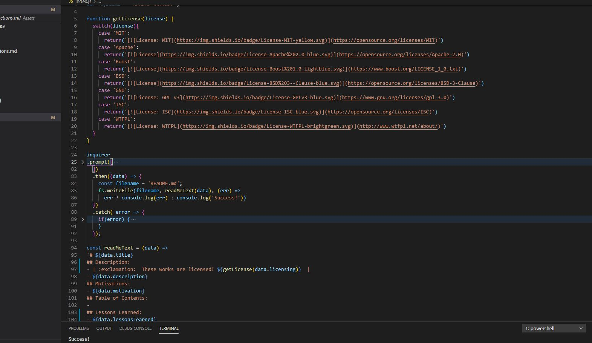

# ReadMe Builder| :exclamation:  These works are licensed!   |
## Description:
- A simple way to build a readme, that is user friendly and fast!
- 
## Motivations:
- I wanted to save time on mundane tasks that are repeated.
## Table of Contents:
- [Description](#Description)
- [Motivations](#Motivations)
- [Lessons Learned](#Lessons-Learned)
- [Installation](#Installation)
- [Usage](#Usage)
- [Contributions](#Contributions)
- [License](#License)
- [Badges](#Badges)
- [Features](#Features)
- [Tests](#Tests)
- [Questions](#Questions)
## Lessons Learned:
- Inquirer is a very powerful tool, and fun to use
## Installation:
- Step 1: Run npm i, \n - Step 2: 'node index.js'
- [Video Support](https://drive.google.com/file/d/1KtTK93NbrRAysQ8mCmOLkiusGqnDZJDB/view)
## Usage:
 - Anyone in need of an Application README can use this App, simply follow the steps above!
## Contributions:
 - None
## License:
 - 
## Badges:
 - None
## Features:
 - I would like to make some more in-depth dropdown features in the future
## Tests:
 - None
## Questions?
- [GITHUB](https://github.com/JoeDonMalone)
- 
<a href="mailto:Joe.d.malone@gmail.com">CONTACT ME</a>

